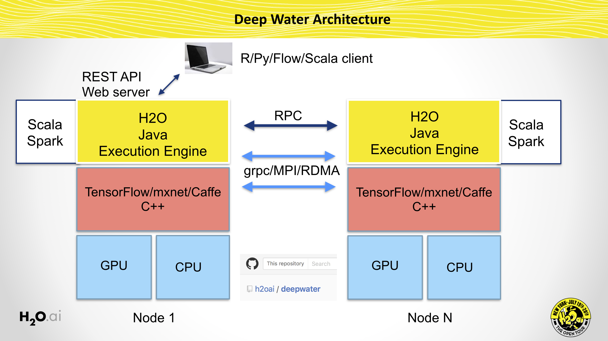

# Deep Water

Native implementation of Deep Learning models for GPU backends (mxnet, Caffe, TensorFlow, etc.)



## Build Requirements

1. A C++ compiler with C++11 support
1. [SWIG](http://www.swig.org/)
1. [BLAS](http://www.netlib.org/blas/)
1. [OpenCV](http://opencv.org) - optional

### Ubuntu

```bash
sudo apt-get install libatlas-base-dev libblas-dev libopencv-dev swig -y
git clone https://github.com/h2oai/deepwater.git
git submodule update --init --recursive
cd mxnet
cp make/config.mk .
### EDIT config.mk - USE_OPENCV=0, USE_CUDA=1, USE_CUDA_PATH=...
make -j8
cd ..
make pkg # will generate a `jar` file including native code.
```

### Macosx

1. Install [homebrew](http://brew.sh).
```bash
git clone https://github.com/h2oai/deepwater.git
git submodule update --init --recursive
brew update
brew tap homebrew/science
brew install opencv
cd mxnet; cp make/osx.mk ./config.mk; make -j$(sysctl -n hw.ncpu)
cd ..
make pkg # will generate a `jar` file including native code.
```
For other options see the [official mxnet build instructions](http://mxnet.readthedocs.io/en/latest/how_to/build.html#building-on-osx).

Please add these lines below into your Java code when using this jar as external dependency.

```Java
util.loadCudaLib();
util.loadNativeLib("mxnet");
util.loadNativeLib("Native");
```

An example implementation can be found in [H2O](https://github.com/h2oai/h2o-3/blob/deepwater/h2o-algos/src/test/java/hex/deeplearning/DeepWaterTest.java).
