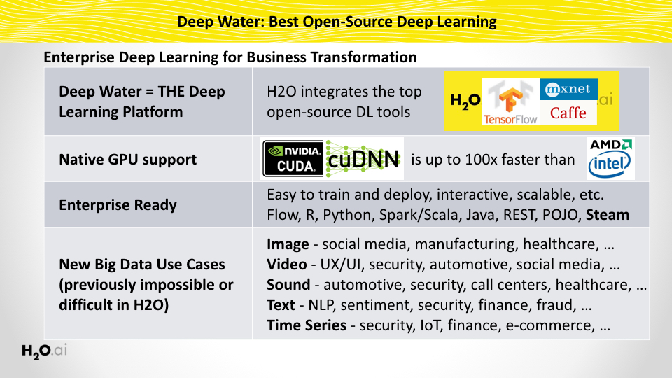
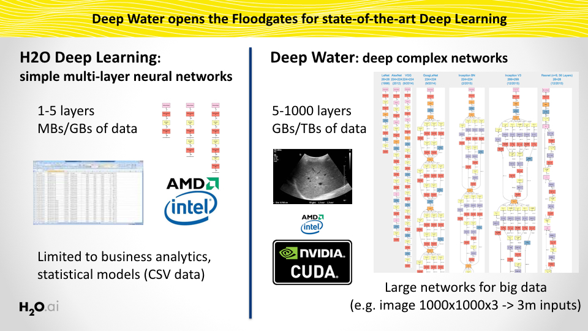
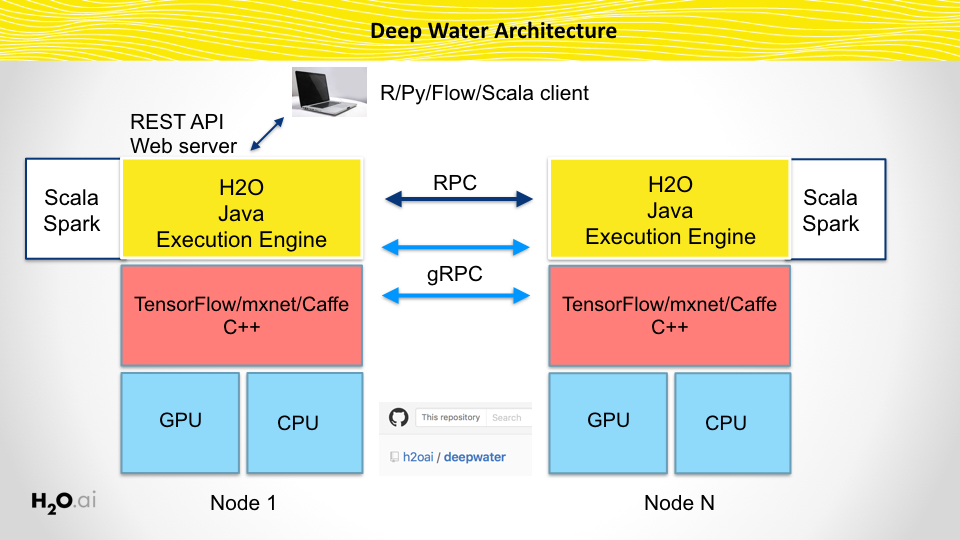
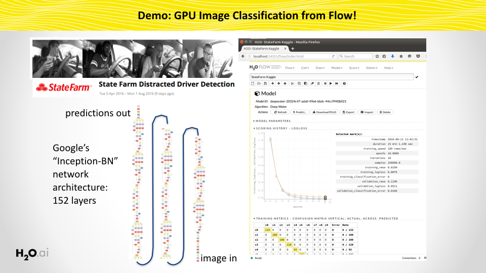

# Deep Water

### What it is
* Native implementation of Deep Learning models for GPU-optimized backends (MXNet, Caffe, TensorFlow, etc.)
* State-of-the-art Deep Learning models trained from the H2O Platform
* Train user-defined or pre-defined deeplearning models for image/text/H2OFrame classification from Flow, R, Python, Java, Scala or REST API
* Behaves just like any other H2O model (Flow, cross-validation, early stopping, hyper-parameter search, etc.)
* The next best thing after sliced bread
* Under development

### What it is not
* An oil drilling platform

### Python/R Jupyter Notebooks
Check out a sample of cool Deep Learning [Jupyter notebooks](https://github.com/h2oai/h2o-3/tree/master/examples/deeplearning/notebooks)!

### Pre-Release Downloads
#### This latest release of Deep Water is based on H2O-3 3.10.3.1 "Tverberg-1" 1b263c79 - Jan 28 2017

The downloadable packages below are built for the following system specifications:

* Ubuntu 16.04 LTS
* Latest NVIDIA Display driver
* CUDA 8.0.44 or later (we recommend the latest version) in /usr/local/cuda
* CUDNN 5.1 or later (placed inside of lib and include directories in /usr/local/cuda/)

To use the GPU, please set the following environment variables:
```
export CUDA_PATH=/usr/local/cuda
export LD_LIBRARY_PATH=$CUDA_PATH/lib64:$LD_LIRBARY_PATH
```

#### Python + Flow (most common)
* Required to run python [Jupyter notebooks](https://github.com/h2oai/h2o-3/tree/master/examples/deeplearning/notebooks): [H2O Deep Water enabled Python module](https://slack-files.com/T0329MHH6-F3YGK308N-bdf9f90d83) -- install via `pip install <file>`
* To build custom networks from Python: [Matching MXNet Python egg](https://slack-files.com/T0329MHH6-F3YGTF3AT-575207850f) -- install via `easy_install <file>`

#### R + Flow (R users)
* Required to run R examples: [H2O Deep Water enabled R package](https://slack-files.com/T0329MHH6-F3X5Z9NN5-9ff02f4773) -- install via `R CMD INSTALL <file>`
* To build custom networks from R: [Matching MXNet R package](https://slack-files.com/T0329MHH6-F3XRXB5BL-db9665bd6d) -- install via `R CMD INSTALL <file>`

#### Flow (Web UI)
* To run from Flow only: [H2O Standalone h2o.jar](https://slack-files.com/T0329MHH6-F3XUA5YVA-1d3161be65) -- launch via `java -jar h2o.jar`

If you are interested in running H2O Deep Water on a different infrastructure, see the DIY build instructions below.

### Running GPU enabled Deep Water in H2O
#### (Optional) Launch H2O by hand and build Deep Water models from Flow (`localhost:54321`)

```
java -jar h2o.jar
```

#### Java example use cases
Example [Java GPU-enabled unit tests](https://github.com/h2oai/h2o-3/tree/master/h2o-algos/src/test/java/hex/deepwater).

#### Python example use cases
Example [Python GPU-enabled unit tests](https://github.com/h2oai/h2o-3/tree/master/h2o-py/tests/testdir_algos/deepwater).
Check out a sample of cool Deep Learning Python [Jupyter notebooks](https://github.com/h2oai/h2o-3/tree/master/examples/deeplearning/notebooks)!

#### R example use cases
Example [R GPU-enabled unit tests](https://github.com/h2oai/h2o-3/tree/master/h2o-r/tests/testdir_algos/deepwater).
Check out a sample of cool Deep Learning R [Jupyter notebooks](https://github.com/h2oai/h2o-3/tree/master/examples/deeplearning/notebooks)!

#### Scala / Sparkling Water example use cases
Coming soon.


### Pre-Release Amazon AWS Image
For your convenience, here's a pre-built image for Amazon's EC2 environment, based off our recent [H2O Open Tour Hands-On Deep Water workshop](https://twitter.com/ArnoCandel/status/791280896318042112). (Recording coming soon.)

* AMI ID: ami-10bd9607
* AMI Name: deepwater-dallas-v4
* Recommended instance types: g2.2xlarge or p2.xlarge
* After launching the instance, you can connect to port 8888 (Jupyter Notebook) or port 54321 (H2O Flow).

Refer to the [Deep Water Workshop on EC2 Amazon AMI](https://github.com/h2oai/deepwater/blob/master/docs/open-tour-dallas/deep-water-ami.md) document for additional information on how to run this AMI. 

### Roadmap, Architecture and Demo
Download the [Deep Water overview slides](https://github.com/h2oai/deepwater/blob/master/architecture/deepwater_overview.pdf).








### DIY Build Instructions
If you want to use Deep Water in H2O-3, you'll need to have a .jar file that includes backend support for at least one of MXNet, Caffe or TensorFlow.

#### 1. Build MXNet 
[Instructions to build MXNet](https://github.com/h2oai/deepwater/tree/master/mxnet)

#### 2. Build TensorFlow 
[Instructions to build TensorFlow](https://github.com/h2oai/deepwater/tree/master/tensorflow)

#### 3. Build Caffe 
Coming soon.

#### 4. Build H2O Backend Connectors
From the top-level of the deepwater repository, do
```
./gradlew build -x test
```

This will create the following file: `build/libs/deepwater-all.jar`

#### 5. Add DeepWater support to H2O-3
You need to check out the [h2o-3](http://github.com/h2oai/h2o-3/).
Copy the freshly created jar file `build/libs/deepwater-all.jar` from the previous step to H2O-3's library `h2o-3/lib/deepwater-all.jar` (create the directory if it's not there) and you're done!

##### Build H2O-3 as usual:
```
./gradlew build -x test
```

This H2O version will now have GPU Deep Learning support!

To use the GPU, please make sure to set your path to your CUDA installation:

```
export CUDA_PATH=/usr/local/cuda
```

##### Install the Python wheel:
```
sudo pip install h2o-3/h2o-py/dist/h2o-3.11.0.99999-py2.py3-none-any.whl
```

##### (Optional) Install the MXNet Python/R packages
If you want to build your own MXNet models from Python or R, install the MXNet wheel (which was built together with MXNet above):
```
sudo easy_install deepwater/thirdparty/mxnet/python/dist/mxnet-0.7.0-py2.7.egg
R CMD INSTALL deepwater/thirdparty/mxnet/mxnet_0.7.tar.gz
```


### Releasing
The release process bundles all defined submodules and push them into Maven central via Sonatype repository provider.
The released artifacts are Java 6 compatible.

The release can be invoked for all modules by:
```bash
./gradlew -PdoRelease -PbuildOnlyBackendApi -PdoJava6Bytecode=true -Prelease.useAutomaticVersion=true release
```

The process performs the following steps:
  - Updates `gradle.properties` and removes `SNAPSHOT` and increases minor version (can be changed)
  - Creates a new release commit and tags it with release tag. (See `gradle/release.gradle` file to override the default template.)
  - Builds
  - Verifies compatibility of used API with Java 6 API
  - Bytecode rewrite to be compatible with Java 6
  - Generation of artifact metadata 
  - Pushes artifacts into staging area at [https://oss.sonatype.org/](https://oss.sonatype.org/)

The process needs to be finished manually by:
  - Logging in to [https://oss.sonatype.org/#stagingRepositories](https://oss.sonatype.org/#stagingRepositories)
  - Performing the actions "Close" and "Release" for the `ai.h2o` staging area
    - **Note**: Be careful because the area can contain more artifacts from different H2O projects.

> Note: The release process creates two new commits and a new tag with the release version. However, the process does not push it to a remote repository, so it is necessary to perform a remote update manually using `git push --tags` or update the `gradle/release.gradle` settings and remove the `--dry-run` option from the `pushOptions` field.

